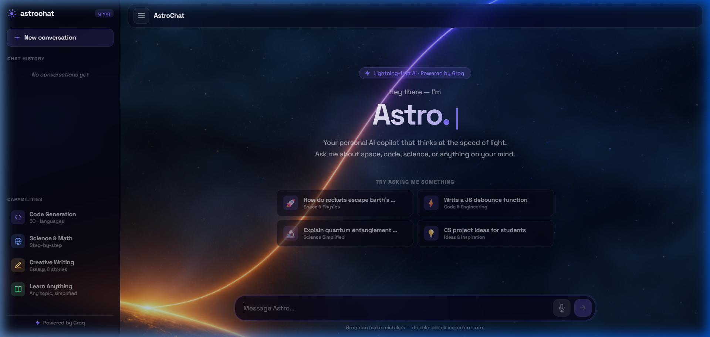

# 🚀 AstroChat — Groq AI Chatbot

A space-themed AI chatbot built with **Groq API**. Features a stunning glassmorphism UI over a space background, real-time conversation with Groq (Llama 3), and markdown-rendered responses.



## Features

- **Groq Integration** — Powered by Groq's Llama 3 70B for ultra-fast, intelligent responses
- **Dynamic Vanta.js Fog + Space Theme** — A stunning space background layered with an interactive, animated fog effect
- **Glassmorphism UI** — Modern, translucent panels and message bubbles with responsive sidebar architecture
- **Voice-to-Text Input** — Built-in microphone support utilizing the Web Speech API for hands-free chatting
- **AI Image Generation** — Capable of generating inline images seamlessly via Pollinations.ai when requested
- **Markdown Support** — Beautifully renders code blocks, bold text, italics, lists, and images in chat responses
- **Persistent Chat History** — Saves conversations locally so you never lose context between sessions
- **Secure API Handling** — API key stays server-side via `.env`, never exposed to the browser
- **Responsive Design** — Works seamlessly on desktop and mobile with an off-canvas mobile menu

## Tech Stack

- **Frontend:** HTML, CSS, JavaScript (Vanilla), Vanta.js (Fog)
- **Backend:** Node.js (lightweight HTTP server)
- **AI Model:** Groq (llama-3.3-70b-versatile)
- **Fonts:** Space Grotesk + JetBrains Mono

## Getting Started

### Prerequisites
- [Node.js](https://nodejs.org/) (v18 or higher)
- A [Groq API Key](https://console.groq.com/keys)

### Installation

1. **Clone the repository**
   ```bash
   git clone https://github.com/nirupam-dev/Gemini-Chatbot.git
   cd Gemini-Chatbot
   ```

2. **Install dependencies**
   ```bash
   npm install
   ```

3. **Create a `.env` file** in the root directory
   ```
   GROQ_API_KEY=gsk_your_groq_api_key_here
   ```

4. **Start the server**
   ```bash
   npm start
   ```

5. **Open in browser**
   ```
   http://localhost:3456
   ```

## Project Structure

```
Gemini-Chatbot/
├── index.html      # Main HTML structure with sidebar and layout
├── style.css       # Glassmorphism, animations, and Vanta fog styles
├── app.js          # Chat logic, speech-to-text, and local history storage
├── server.js       # Node.js server (API proxy)
├── hero-bg.png     # Space background image layer
├── preview.png     # Application screenshot
├── package.json    # Node.js dependencies
├── .env            # API key (not tracked)
└── .gitignore      # Git ignore rules
```

## Screenshots

The chatbot features a sleek sidebar layout, voice input capabilities, responsive glassmorphism design, and an interactive fog-layered space background.

## License

This project is open source and available under the [MIT License](LICENSE).
